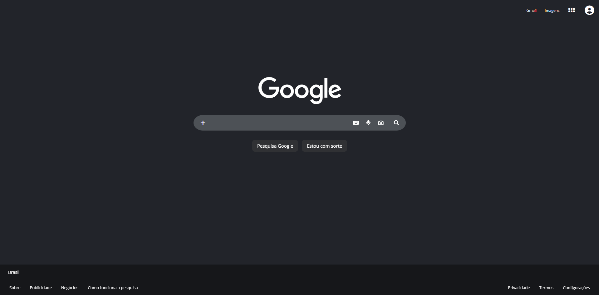

# CLONE DO GOOGLE DARK - HTML/CSS
> [Clique aqui para acessar o link do projeto](https://danielrlimax.github.io/google-clone)
<div align="center">
  
</div>


## Sobre o Projeto:
Este projeto é uma recreação visual da interface de busca do Google. o objetivo principal foi consolidar meus conhecimentos em CSS Moderno com Flexbox e estruturação de layouts complexos mantendo a fidelidade visual.

Este repositório faz parte do meu plano de estudos e práticas para me tornar um desenvolvedor Full Stack.

## Tecnologias Utilizadas:
- **HTML5** (Semântico)
- **CSS3** (Variáveis, Flexbox)
- **Font Awesome** (ícones)

## Desafios Técnicos e Aprendizados:
Durante o desenvolvimento, foquei em resolver problemas reais de interface que encontrei, como:

- **Stick Footer:** Implementei a técnica de `flex-direction`: column no body com `min-height` de 100vh para garantir que o rodapé ficasse sempre na base da dela, independente da quantidade de conteúdo.

- **Componentização da Barra de Busca:** Desafio em unir multiplos elementos (input e botões de ícone) para que parecessem uma peça única, utilizando `flex-grow` e removendo as bordas nativos de foco `(outline)`.

- **Posicionamento Visual**: Ajuste fino do conteúdo central para não ficar no centro matemático perfeito, simulando o respiro superior que o Google utiliza para melhorar a experiência do usuário (UX).

## Como rodar o projeto:
1. Clone este repositório
```
git clone https://github.com/danielrlimax/google-clone.git
```

2. Abra o arquivo ``index.html`` no seu navegador ou utilize a extensão [Live Server](https://marketplace.visualstudio.com/items?itemName=ritwickdey.LiveServer) no [VsCode](https://code.visualstudio.com/).

## Funcionalidades Implementadas:
- [X] - Layout Header com alinhamento de perfil
- [X] - Barra de busca com estado de foco automático
- [X] - Botões Centrais com efeitos hover
- [X] - Footer duplo padrão Google
- [X] - Links totalmente funcionais e corretos
- []  - Refatoração e limpeza de código (Próximo passo)

## Autor:
### Daniel de Lima - Estudante de ADS e Apaixonado por Front-End e Web Design
- Instagram: [@dev_delima](https://instagram.com/dev_delima)
- Portfólio: [Em construção]()